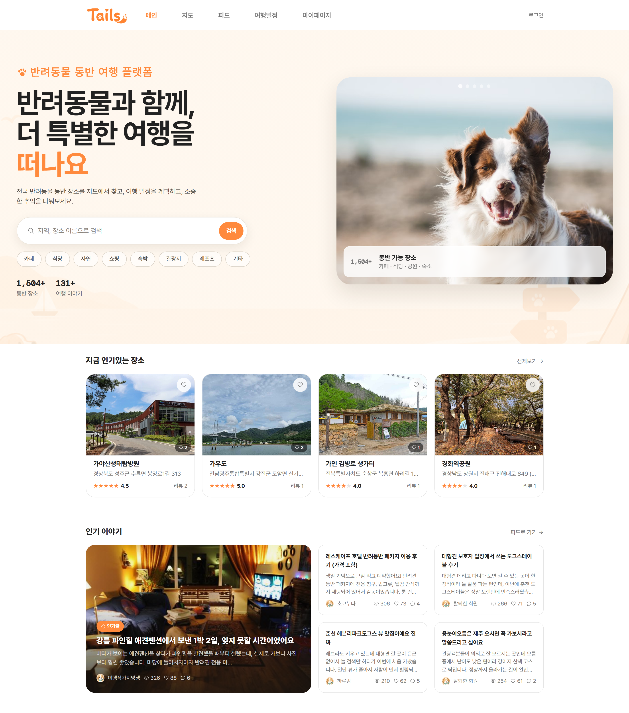

# Hangyeol's Github

<picture>
  <source media="(prefers-color-scheme: dark)" srcset="https://raw.githubusercontent.com/1gyeolpark/1gyeolpark/output/github-contribution-grid-snake-dark.svg">
  <source media="(prefers-color-scheme: light)" srcset="https://raw.githubusercontent.com/1gyeolpark/1gyeolpark/output/github-contribution-grid-snake.svg">
  
</picture>

  

###  Contact

 

### Tech Stack

     

     

   

 

### Studying

     

  

## 🚀 Projects

<table width="100%">
<tr>
<td width="260" align="center">

</td>
<td>

### Tails(반려동물 동반 여행 서비스) 
> <small>반려동물과 여행할 수 있는 장소를 검색하고, 여행 일정을 계획하는 서비스</small>

      

- JWT Access/Refresh 토큰 인증
- 카카오·구글·네이버 OAuth2 소셜 로그인
- 게시판 CRUD, 좋아요·북마크, 무한 depth 대댓글
- 반려동물 등록 CRUD
- 이벤트 기반 알림 + FCM 웹 푸시

 
</td>
</tr>
</table>

 

 

## 📊 GitHub Stats

